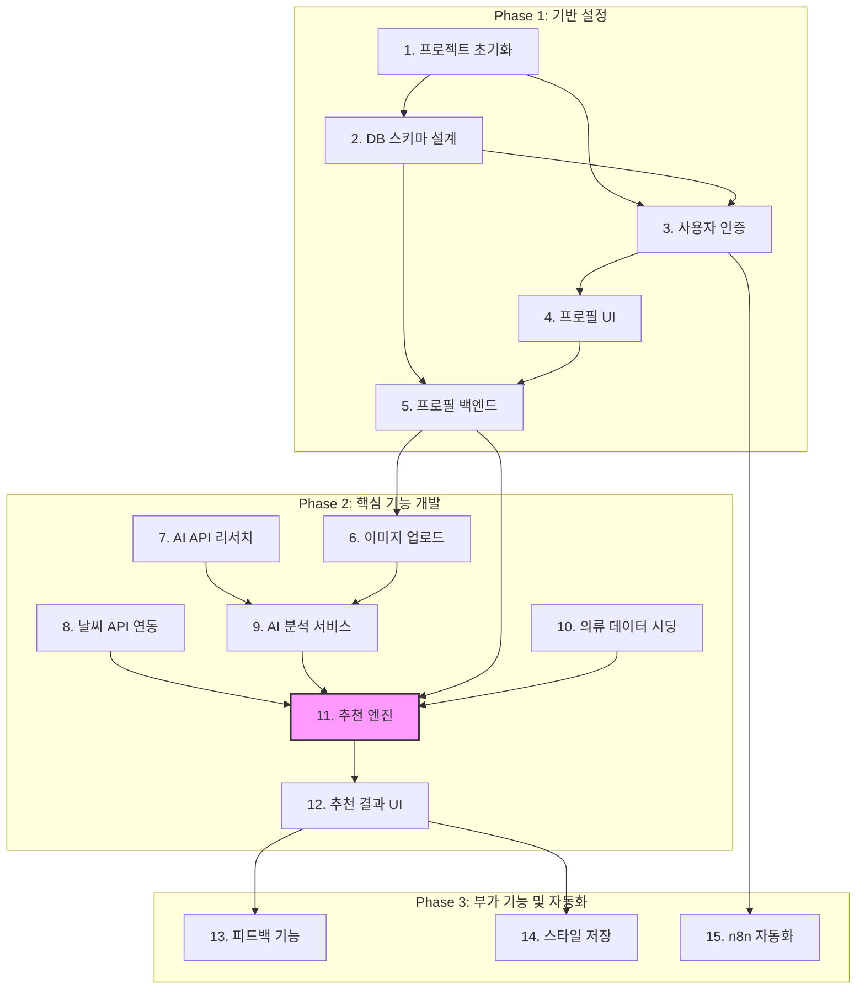

# AI 스타일링 추천 서비스 개발 작업 명세서

이 문서는 'AI 코딩 에이전트용 개인 맞춤형 스타일링 추천 서비스' PRD를 기반으로 생성된 구체적인 개발 작업 목록과 순서도입니다.

## 📝 작업 요약

총 15개의 주요 작업과 4개의 하위 작업으로 구성되어 있습니다. 각 작업은 의존성에 따라 순차적으로 진행해야 하며, 복잡도 점수를 통해 예상 소요 시간을 예측할 수 있습니다.

## 📋 전체 작업 목록

| ID | 작업 제목 | 우선순위 | 의존성 | 복잡도 |
| --- | --- | --- | --- | --- |
| 1 | 프로젝트 초기화 및 의존성 설정 | High | - | 2 |
| 2 | Supabase 데이터베이스 스키마 설계 및 구현 | High | 1 | 4 |
| 3 | 사용자 인증 구현 (회원가입/로그인) | High | 1, 2 | 6 |
| 4 | 사용자 프로필 페이지 및 폼 생성 | High | 3 | 3 |
| 5 | 사용자 프로필 관리 백엔드 개발 | High | 2, 4 | 4 |
| 6 | Supabase Storage를 이용한 프로필 이미지 업로드 구현 | Medium | 5 | 5 |
| 7 | AI 분석을 위한 외부 API 리서치 및 선정 | High | - | 3 |
| 8 | 날씨 API 연동 | Medium | - | 3 |
| 9 | AI 분석 서비스 구현 | Medium | 6, 7 | 6 |
| 10 | 의류 아이템 데이터베이스 시딩 | Medium | 2 | 2 |
| 11 | **핵심 추천 엔진 로직 개발** | High | 5, 8, 9, 10 | 8 |
| 12 | 일일 추천 결과 표시 UI 구축 | High | 11 | 4 |
| 13 | 추천 피드백(좋아요/싫어요) 기능 구현 | Medium | 12 | 3 |
| 14 | '스타일 저장' 기능 구현 | Low | 12 | 5 |
| 15 | n8n을 이용한 워크플로우 자동화 설정 | Low | 3 | 4 |

---

### 📌 세부 작업 내용

#### **1. 프로젝트 초기화 및 의존성 설정**
- **설명**: Next.js 프로젝트를 초기화하고 Supabase 클라이언트 및 UI 라이브러리 등 필수 의존성을 설치합니다.

#### **2. Supabase 데이터베이스 스키마 설계 및 구현**
- **설명**: PRD에 명시된 모든 기능을 지원하기 위해 필요한 테이블(사용자, 의류, 추천 등)을 Supabase에 정의하고 생성합니다.

#### **3. 사용자 인증 구현 (회원가입/로그인)**
- **설명**: Supabase Auth를 사용하여 사용자가 가입, 로그인, 로그아웃할 수 있는 인증 흐름을 설정합니다.

#### **4. 사용자 프로필 페이지 및 폼 생성**
- **설명**: 사용자가 자신의 개인 정보(성별, 나이, 선호 스타일 등)를 입력하고 수정할 수 있는 UI를 개발합니다.

#### **5. 사용자 프로필 관리 백엔드 개발**
- **설명**: 사용자 프로필 생성 및 업데이트를 처리하는 API 엔드포인트를 개발합니다.

#### **6. Supabase Storage를 이용한 프로필 이미지 업로드 구현**
- **설명**: 사용자가 얼굴 및 전신 사진을 프로필에 업로드하고, 이를 Supabase Storage에 저장하는 기능을 추가합니다.

#### **7. AI 분석을 위한 외부 API 리서치 및 선정**
- **설명**: 사용자 이미지로부터 퍼스널 컬러, 체형 등을 분석할 수 있는 외부 AI API를 조사하고 선택합니다.

#### **8. 날씨 API 연동**
- **설명**: 스타일 추천의 입력값으로 사용될 현재 날씨 데이터를 가져오기 위해 외부 날씨 API를 연동합니다.

#### **9. AI 분석 서비스 구현**
- **설명**: 사용자가 업로드한 사진을 선택된 AI API로 전송하고 분석 결과를 저장하는 서비스를 구현합니다.

#### **10. 의류 아이템 데이터베이스 시딩**
- **설명**: 추천 엔진에서 사용할 샘플 의류 데이터를 `clothing_items` 테이블에 미리 채워 넣습니다.

#### **11. 핵심 추천 엔진 로직 개발**
- **설명**: 사용자 및 환경 데이터를 기반으로 완전한 코디 스타일링 추천을 생성하는 알고리즘의 초기 버전을 개발합니다.
- **하위 작업**:
    - **11.1**: 사용자 데이터베이스 스키마 설계 및 구현
    - **11.2**: 사용자 등록 API 엔드포인트 개발
    - **11.3**: 사용자 로그인 및 JWT 생성 구현
    - **11.4**: 보호된 라우트를 위한 인증 미들웨어 생성

#### **12. 일일 추천 결과 표시 UI 구축**
- **설명**: 메인 페이지에 일일 스타일링 추천 결과를 사용자에게 보여주는 UI를 생성합니다.

#### **13. 추천 피드백(좋아요/싫어요) 기능 구현**
- **설명**: 추천 결과에 '좋아요' 및 '싫어요' 버튼을 추가하여 사용자의 피드백을 수집하는 기능을 구현합니다.

#### **14. '스타일 저장' 기능 구현**
- **설명**: 사용자가 마음에 드는 추천 의상을 개인 컬렉션에 저장하여 나중에 다시 볼 수 있도록 하는 기능을 구현합니다.

#### **15. n8n을 이용한 워크플로우 자동화 설정**
- **설명**: n8n 인스턴스를 설정하고 데이터 처리 작업을 자동화하는 초기 워크플로우를 생성합니다.

---

## 🌊 작업 순서도 (의존성 그래프)

